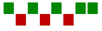

# Sparklines

## Install

```javascript
npm install @qumeleon/sparklines
````

## Quick start

### Line graph


````javascript
// create an element on your page which will contain the sparkline
const myDiv = document.createElement('div')
myDiv.setAttribute('style', 'width: 100px; background: #fff; padding: 5px')

// your values (data)
const values = [1, 3, 9, -4, 7, 2, 12, 0, 1]

// create the sparkline
const sparkLine = new SparkLineGraph({
    width: 100,
    height: 50,
    // color any valid css color name or hex/rgb(a) code
    // if not specified 'currentColor' is used
    color: 'gray'
}, values)

// render the sparkline, and attach it to your element
myDiv.appendChild(sparkLine.render())
````

### Column chart


```javascript
const myDiv = document.createElement('div')
myDiv.setAttribute('style', 'width: 100px; background: #fff; padding: 5px')

// your values (data)
const values = [8, 23, 9, -4, 7, 21, 4, 12]

// create the sparkline
const sparkLine = new SparkLineColumnChart({
  width: 100,
  height: 50,
  color: '#5fadf5'
}, values)

// render the sparkline, and attach it to your element
myDiv.appendChild(sparkLine.render())
```

### Win / Loss



````javascript
// create an element on your page which will contain the sparkline
const myDiv = document.createElement('div')
myDiv.setAttribute('style', 'width: 160px; background: #fff; padding: 5px')

// your values (win loss points)
// note that these can be any positive/negative numbers
const winLossPoints = [18, -3, 9, -4, 7, -21, 4, 12]

// create the sparkline
const sparkLine = new SparkLineWinLoss({
  width: 160,
  height: 40,
  colorWin: 'green',
  colorLoss: 'red',
}, winLossPoints)

// render the sparkline, and attach it to your element
myDiv.appendChild(sparkLine.render())
````

### Line graph with markers (dots)


````javascript
// create an element on your page which will contain the sparkline
const myDiv = document.createElement('div')
myDiv.setAttribute('style', 'width: 200px; background: #fff; padding: 5px')
// your values (data)
const values = [1, 3, 9, -4, 7, 2, 12, 0, 1]
// create the sparkline
const sparkLine = new SparkLineGraph({
    width: 180,
    height: 60,
    lineWidth: 1.67, // optional
    markers: {
        color: 'blue', // any valid css color name or hex/rgb(a) code
        size: 5
    }
}, values)

// render the sparkline, and attach it to your element
myDiv.appendChild(sparkLine.render())
````
